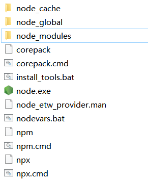
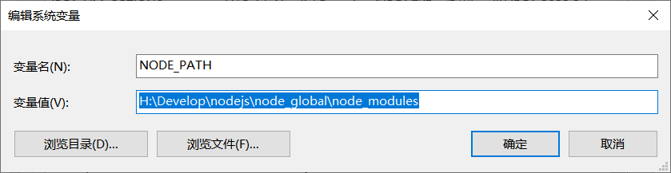
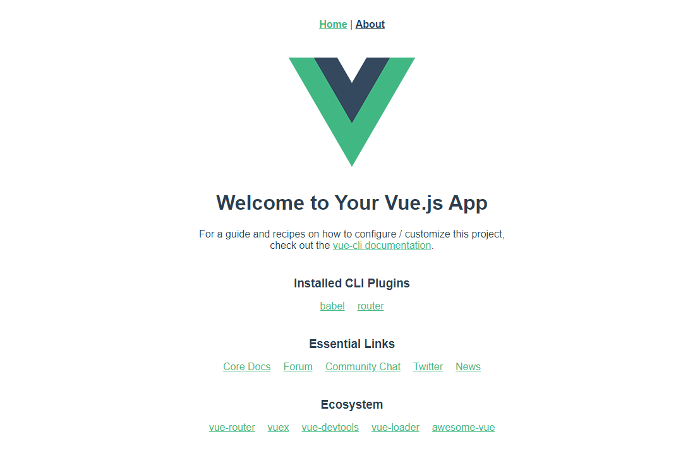
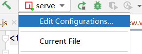
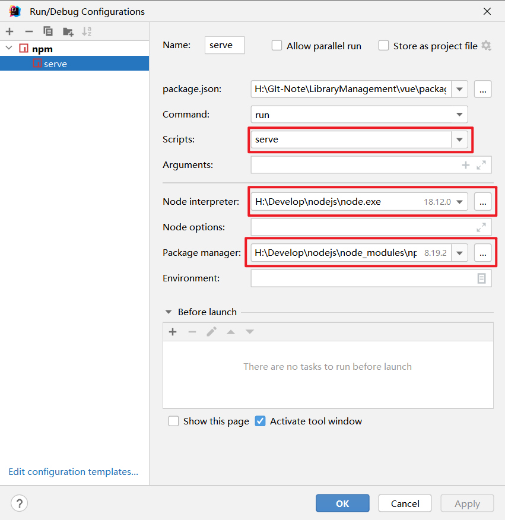

# LibraryManagement

Front-end and Back-end Separation for library management system.

## 1. 准备阶段

### 1.1 准备知识

- JavaSE、servlet、JDBC、Maven、Mybatis、SpringMVC、SSM（了解）、Springboot；
- MySQL数据库简单的SQL语法；
- 前端页面：HTML、CSS、JS、vue2相关语法。

### 1.2 Vue安装及环境配置

#### 1.2.1 node.js安装和配置

- 下载安装node.js

  官网下载安装node.js：https://nodejs.org/en/download/，由于Node.js 中默认安装了npm；验证是否安装成功`node -v`与 `npm -v`分别查看版本信息。

  安装路径：`H:\Develop\nodejs`

- 配置默认安装目录和缓存日志目录

  在安装路径创建文件夹`node_global`以及`node_cache`；

  

- 将npm的全局模块目录和缓存目录配置到创建的目录

  ```sh
  npm config set prefix "H:\Develop\nodejs\node_global"
  npm config set cache "H:\Develop\nodejs\node_cache"
  ```

  验证是否成功

  ```sh
  npm config get prefix 
  #查看npm全局安装包保存路径
  
  npm config get cache
  #查看npm装包缓存路径
  
  #OR
  npm list -global
  #查看全局安装目录
  ```

- node.js环境配置

  新建NODE_PATH

  

  在系统变量下的Path添加`H:\Develop\nodejs`

  如果设置了全局安装目录，存在`H:\Develop\nodejs\node_global`

- 配置淘宝镜像源

  永久使用，直接修改npm的默认配置

  ```sh
  npm config set registry https://registry.npm.taobao.org
  ```

  验证：`npm config get registry`or`npm config list`

#### 1.2.2 安装vue/cli

官方文档：https://cli.vuejs.org/zh/guide/installation.html

在指定的项目下运行：

```sh
npm install -g @vue/cli
# OR
yarn global add @vue/cli
```

例如：

```sh
C:\Windows\system32>cd H:\GIt-Note\LibraryManagement
C:\Windows\system32>h:
H:\GIt-Note\LibraryManagement>npm install -g @vue/cli
```

安装成功

```sh
npm WARN deprecated source-map-url@0.4.1: See https://github.com/lydell/source-map-url#deprecated
npm WARN deprecated urix@0.1.0: Please see https://github.com/lydell/urix#deprecated
npm WARN deprecated resolve-url@0.2.1: https://github.com/lydell/resolve-url#deprecated
npm WARN deprecated source-map-resolve@0.5.3: See https://github.com/lydell/source-map-resolve#deprecated
npm WARN deprecated subscriptions-transport-ws@0.11.0: The `subscriptions-transport-ws` package is no longer maintained. We recommend you use `graphql-ws` instead. For help migrating Apollo software to `graphql-ws`, see https://www.apollographql.com/docs/apollo-server/data/subscriptions/
#switching-from-subscriptions-transport-ws    For general help using `graphql-ws`, see https://github.com/enisdenjo/graphql-ws/blob/master/README.md

added 846 packages in 2m
```

#### 1.2.3 创建Vue工程

1. ```sh
   # 创建文件夹名为vue的vue工程
   H:\GIt-Note\LibraryManagement>vue create vue
   ```

2. ```sh
   Vue CLI v5.0.8
   ? Please pick a preset:
     Default ([Vue 3] babel, eslint)
     Default ([Vue 2] babel, eslint)
   > Manually select features  #回车选择 
   ```

3. ```sh
   ? Check the features needed for your project: (Press <space> to ? Check the features needed for your project: (Press <space> to
   select, <a> to toggle all, <i> to invert selection, and <enter>
   to proceed)
   >(*) Babel  # 按下空格选择或取消
    ( ) TypeScript
    ( ) Progressive Web App (PWA) Support
    (*) Router #
    ( ) Vuex
    ( ) CSS Pre-processors
    ( ) Linter / Formatter
    ( ) Unit Testing
    ( ) E2E Testing
   ```

4. ```sh
   Vue CLI v5.0.8
   ? Please pick a preset: Manually select features
   ? Check the features needed for your project: (Press <space> to ? Check the features needed for your project: Babel, Router
   ? Choose a version of Vue.js that you want to start the proj? Choose a version of Vue.js that you want to start the
   project with
     3.x
   > 2.x  # 选择2.x版本
   ```

5. `Y`确定

6. ```sh
   ? Where do you prefer placing config for Babel, ESLint, etc.?
     In dedicated config files
   > In package.json # 选择json
   ```

7. 保存项目`Y`，设置名称`babal-router`

8. 创建完成后，启动项目

   ```sh
   cd vue
   npm run serve #启动
   ```

   ```sh
    #成功启动
    DONE  Compiled successfully in 10745ms                   
    
     App running at:
     - Local:   http://localhost:8080/
     - Network: http://192.168.2.18:8080/
   
     Note that the development build is not optimized.
     To create a production build, run npm run build.
   ```

9. 重启项目

   `Ctrl + c`关闭项目；

   ```sh
   H:\GIt-Note\LibraryManagement\vue>npm run serve
   ```

10. 启动成功

    

### 1.3  使用elementUI

官网：https://element.eleme.cn/

安装 ElementUI：`npm i element-ui -S`

```sh
H:\GIt-Note\LibraryManagement\vue> npm i element-ui -S
```

在Vue项目中导入：

```js
import ElementUI from 'element-ui';
import 'element-ui/lib/theme-chalk/index.css';
```

```js
Vue.use(ElementUI);
```

### 1.4 在IDEA中启动vue

1. 
2. 
3. RUN

```sh
 DONE  Compiled successfully in 19533ms                         

  App running at:
  - Local:   http://localhost:8080/
  - Network: http://192.168.2.18:8080/

  Note that the development build is not optimized.
  To create a production build, run npm run build.
```
