 [README.md](..\README.md) 准备阶段！

# 1、完成主页布局

图标网站：https://www.iconfont.cn/

ElementUI官方文档：https://element.eleme.cn/#/zh-CN/component

- 在`main.js`中导入ElemetUI；

  ```js
  //导入ElemetUI
  import ElementUI from 'element-ui';
  import 'element-ui/lib/theme-chalk/index.css';
  ```

- 导入`src`中的`global.css`文件；

  ```js
  // 导入src下的css文件
  import '@/assets/global.css'
  ```

```js
import Vue from 'vue'
import App from './App.vue'
import router from './router'

//导入ElemetUI
import ElementUI from 'element-ui';
import 'element-ui/lib/theme-chalk/index.css';

// 导入src下的css文件
import '@/assets/global.css'

Vue.config.productionTip = false
Vue.use(ElementUI);

new Vue({
  router,
  render: h => h(App)
}).$mount('#app')

```

- 在`global.css`中清除所有的样式，设置背景颜色为`#eee`；

  ```css
  body{
      margin: 0;
      padding: 0;
      background-color: #eee;
  }
  
  *{
      box-sizing: border-box;
  }
  ```

## 1.1头部

头部内容基本不会发生变动，因此在`App.vue`中进行书写。

```vue
<!--  头部  -->
<div style="height: 80px;line-height: 80px;background: white;margin-bottom: 2px">
//	设置行高为80px，背景颜色为白色，下外边距2px
    

//	图片logo
    
<span style="margin-left: 28px;font-size: 24px;font-family: 黑体">图书管理系统</span>
//	左边距为28px

</div>
```

## 1.2左侧菜单

左侧数据内容也是基本不会变动，同样书写在`App.vue`中。

```vue
<!--  侧边栏和主体  -->
<div style="display: flex">
    //	弹性布局
    <!--    侧边栏导航    -->
    ...
	<!--   主体数据   -->
    ...
</div>
```

```vue
 <!--    侧边栏导航    -->
<div style="width: 200px;
      min-height: calc(100vh - 82px);
            // 最小行高 100vh占满全屏，82px = 头部height(80px) + margin-bottom(2px)
      overflow: hidden;
      margin-right: 2px;
      background-color: white">
      <el-menu
          :default-active="$route.path"
          :default-openeds="['/']"	
               //设置默认打开页面为index索引为'/'的页面
          router class="el-menu-demo">

        <el-menu-item index="/">
          <i class="el-icon-s-platform"></i>
          <span>首页</span>
        </el-menu-item>


        <el-submenu>
          <template slot="title">
            <i class="el-icon-more"></i>
            <span>关于页面</span>
          </template>

          <el-menu-item index="/about">详情about</el-menu-item>
          <el-menu-item index="2-2">选项2</el-menu-item>
          </el-submenu>
        <el-menu-item index="3" disabled>消息中心</el-menu-item>
      </el-menu>
</div>
```

## 1.3主体

```vue
<!--   主体数据   -->
<div style="flex: 1;background-color: white">
<router-view/>
    //	当路由path 与访问的地址相符时，会将指定的组件替换该 router-view
    //	在index.js 文件中 path: '/'
    
</div>
```

对于实际显示的（表格等）页面，将在`HomeView.vue`中实现。

```vue
<template>
  <div>
    <!--    搜索表单    -->
      <div style="margin-bottom: 20px">
        <el-input style="width: 240px" placeholder="请输入名称"></el-input>
        <el-input style="width: 240px; margin: 5px" placeholder="请输入联系方式"></el-input>
        <el-button style="margin-left: 5px" type="primary"><i class="el-icon-search"></i>搜索</el-button>
      </div>

    <!--  表头  -->
      <el-table :data="tableData" stripe>
        <el-table-column prop="name" label="名称"></el-table-column>
        <el-table-column prop="age" label="年龄"></el-table-column>
        <el-table-column prop="address" label="地址"></el-table-column>
        <el-table-column prop="phone" label="联系方式"></el-table-column>
        <el-table-column prop="sex" label="性别"></el-table-column>
      </el-table>

    <!-- 分页 -->
    <div style="margin-top: 20px">
      <el-pagination
          background
          layout="prev, pager, next"
          :total="100">
      </el-pagination>
    </div>

  </div>
</template>

<script>

export default {
  name: 'HomeView',
    
  data(){
    return {
      tableData: [
        {name: '王小虎', age: '20', address: '北京市', phone: '181119518',sex:'男'},
        {name: '王大虎', age: '18', address: '上海市', phone: '181119528',sex:'男'},
        {name: '荙拗', age: '20', address: '北京市', phone: '181119518',sex:'女'},
      ]
    }
  }
    
}
</script>
```

# 2、搭建后台服务

## 2.1 创建Springboot项目

File → New → Module → `Spring Initializr`

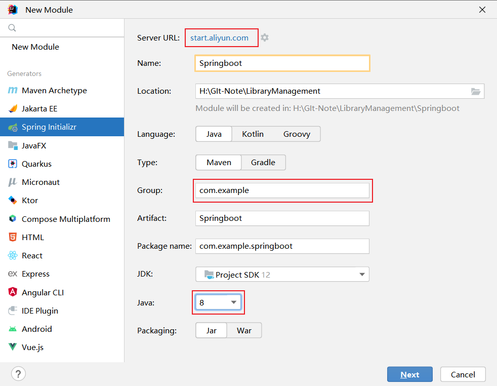

- `Service URL` 报错；

  ```sh
  Initialization failed for 'https://start.spring.io'    
  Please check URL, network and proxy settings.Error message:Cannot download 'https://start.spring.io': connect timed out
  ```

  将默认地址修改为阿里云的地址：`https://start.aliyun.com/`

  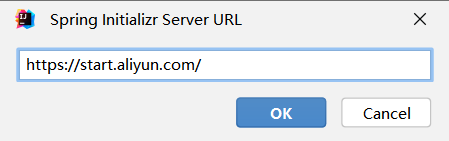

- 设置`Name`；

- 选择`Java` 为 8。

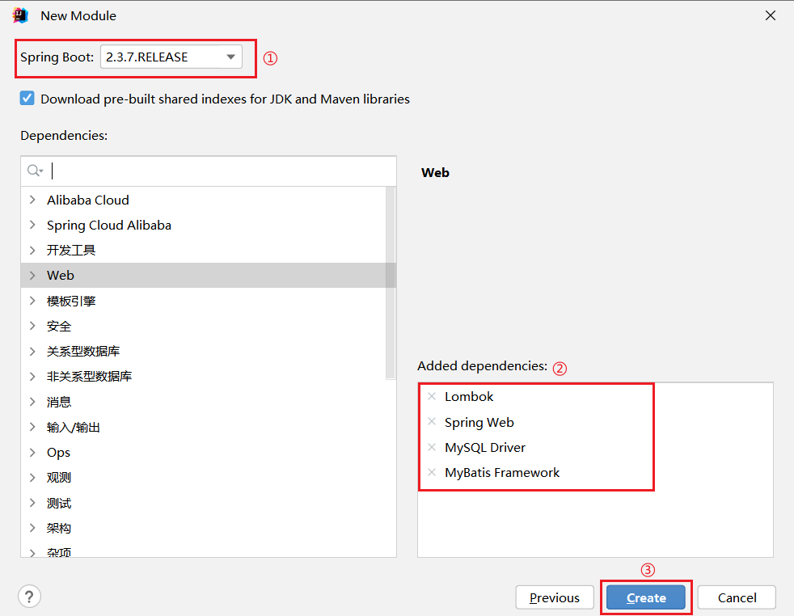

- 选择`Spring Boot` 的版本；
- 添加依赖组件；
  - `Lombok`通过注解`@Data`简化实体类的JavaBean书写，
  - `Spring Web`架构，
  - `MySQL`数据库驱动，
  - `MyBatis`框架，简化JDBC书写。

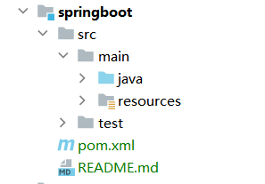

> 当创建完成后，需要等待Maven依赖。在右侧没有出现Maven导航栏：在新版本IDEA中，可以直接添加——打开`pom.xml`文件 → 在文件上右键 → `Add as Maven Project`即可。

## 2.2 连接MySQL数据库

① 创建数据库

```sql
CREATE DATABASE IF NOT EXISTS library-management
DEFAULT CHARACTER SET utf8mb4
DEFAULT COLLATE utf8mb4_unicode_ci;
```

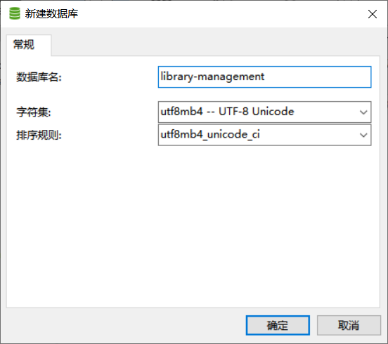

② 创建表

```sql
SET FOREIGN_KEY_CHECKS=0;

DROP TABLE IF EXISTS `user`;
CREATE TABLE `user` (
    -- id自增
  `id` int(11) NOT NULL AUTO_INCREMENT,
  `name` varchar(255) COLLATE utf8mb4_unicode_ci DEFAULT NULL COMMENT '姓名',
  `username` varchar(255) COLLATE utf8mb4_unicode_ci DEFAULT NULL COMMENT '用户名',
  `age` int(11) DEFAULT NULL COMMENT '年龄',
  `sex` varchar(1) COLLATE utf8mb4_unicode_ci DEFAULT NULL COMMENT '性别',
  `phone` varchar(255) COLLATE utf8mb4_unicode_ci DEFAULT NULL COMMENT '联系方式',
  `address` varchar(255) COLLATE utf8mb4_unicode_ci NOT NULL COMMENT '住址',
  PRIMARY KEY (`id`)
    -- id 主键
) ENGINE=InnoDB DEFAULT CHARSET=utf8mb4 COLLATE=utf8mb4_unicode_ci;
```

③ 添加一条数据

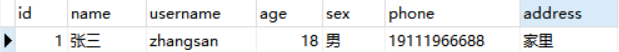

### 2.2.1 配置

一般将`application.properties`改为`application.yml`。

```properties
# 设置springboot的端口号为9090，vue的端口号为8080，不设置会冲突
server:
  port: 9090

spring:
  datasource:
    driver-class-name: com.mysql.jdbc.Driver
    url: jdbc:mysql://localhost:3306/library-management?serverTimezone=GMT%2b8
    # GMT%2b8 东八区 —— 北京时间
    username: root
    password: 123456
```

配置完成后即可启动SpringBoot，出现spring标识即启动成功。

```
  .   ____          _            __ _ _
 /\\ / ___'_ __ _ _(_)_ __  __ _ \ \ \ \
( ( )\___ | '_ | '_| | '_ \/ _` | \ \ \ \
 \\/  ___)| |_)| | | | | || (_| |  ) ) ) )
  '  |____| .__|_| |_|_| |_\__, | / / / /
 =========|_|==============|___/=/_/_/_/
 :: Spring Boot ::        (v2.3.7.RELEASE)
```

## 2.3 大体结构

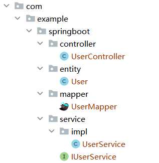

> 1. `entity`包：每一个Java类对应于数据库中的一个表
> 2. `mapper`包：dao数据库访问层
> 3. `service`包：业务逻辑层
> 4. `controller`包：界面层

### 2.3.1 entity包

存放数据库相关的实体类文件。`User`

```java
package com.example.springboot.entity;
import lombok.Data;

//  简化JavaBean的书写
@Data
public class User {
    private Integer id;
    private String name;
    private String username;
    private Integer age;
    private String sex;
    private String phone;
    private String address;
}
```

### 2.3.2 mapper包

创建实体后，需要一个接口来操作实体；mapper包提供数据库访问的方法。`UserMapper`

```java
package com.example.springboot.mapper;
import com.example.springboot.entity.User;
import org.apache.ibatis.annotations.Mapper;
import org.apache.ibatis.annotations.Select;
import java.util.List;

@Mapper
public interface UserMapper {
    /**
     * 查询所有
     * @return
     */
    
//    @Select("select * from user")
//	通过注解的方式
    List<User> listUser();
}
```

### 2.3.3 service包

业务处理层区操作数据库；一般是通过【接口`IUserService`】+【实现类`impl.UserService`】的方法去实现的。

`IUserService`

```java
package com.example.springboot.service;
import com.example.springboot.entity.User;
import java.util.List;

public interface IUserService {
    List<User> listUser();
}
```

实现接口`IUserService`的实现类`UserService`：

```java
package com.example.springboot.service.impl;
import com.example.springboot.entity.User;
import com.example.springboot.mapper.UserMapper;
import com.example.springboot.service.IUserService;
import org.springframework.beans.factory.annotation.Autowired;
import org.springframework.stereotype.Service;
import java.util.List;

@Service	//	标识为一个spring的组件，才可以去调用
public class UserService implements IUserService {
    @Autowired
    UserMapper userMapper;

    //	实现接口，必须重写接口中的方法
    @Override
    public List<User> listUser() {
        return userMapper.listUser();
        // 不安全，需要使用try...catch处理
    }
}
```

### 2.3.4 controller包

实现数据传输给浏览器。`UserController`

```java
package com.example.springboot.controller;
import com.example.springboot.entity.User;
import com.example.springboot.service.IUserService;
import org.springframework.beans.factory.annotation.Autowired;
import org.springframework.web.bind.annotation.CrossOrigin;
import org.springframework.web.bind.annotation.GetMapping;
import org.springframework.web.bind.annotation.RequestMapping;
import org.springframework.web.bind.annotation.RestController;
import java.util.List;

@RestController		// 标识——会以json的数据进行返回
@RequestMapping("/user")	//路由 —— 一级目录
//	@CrossOrigin	解决跨界错误
public class UserController {
    @Autowired
    IUserService userService;

    @GetMapping("/list")	//定义路由 —— 二级目录
    public List<User> listUsers() {
        return userService.listUser();
    }
}
```

从后往前的大体结构如此；通过`Ctrl + Alt + B`可以前往后controller → service → Mapper → entity ，可以更好的理解。

访问`http://localhost:9090/user/list`，可以查询到MySQL数据库中的一条数据，以JSON数据返回。

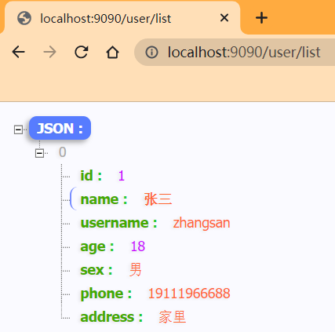

## 2.4 前后端交互

修改`vue/src/HomeView.vue`的代码，通过fetch进行完成。

```vue
<script>
export default {
  name: 'HomeView',
  data(){
    return {
      tableData: []
    }
  },
  created() {
    this.load()
  },
  methods:{
    load() {
      fetch('http://localhost:9090/user/list')
          .then(res => res.json())
          .then(res => {
            console.log(res)
            this.tableData = res
          })
    }
  }
}
</script>
```

### 2.4.1  跨域错误

启动vue前端，发现显示暂无数据，并报错：

```
Access to fetch at 'http://localhost:9090/user/list' from origin 'http://localhost:8080' has been blocked by CORS policy: No 'Access-Control-Allow-Origin' header is present on the requested resource. If an opaque response serves your needs, set the request's mode to 'no-cors' to fetch the resource with CORS disabled.
```

解决方法：在`UserController`中添加注解`@CrossOrigin`

```java
@RestController				// 标识——会以json的数据进行返回
@RequestMapping("/user")	//路由 —— 一级目录
@CrossOrigin				//解决跨界错误
public class UserController {
    @Autowired
    IUserService userService;

    @GetMapping("/list")	//定义路由 —— 二级目录
    public List<User> listUsers() {
        return userService.listUser();
    }
}
```

其他解决方法，参考：[https://cloud.tencent.com/developer/article/1911678](解决跨域问题的 5 种方法)

### 2.4.2 通过XML交互

Mybatis官网：[https://mybatis.net.cn/getting-started.html](MyBatis官网)

在mapper中，是通过书写注解的方式来实现交互的。

```java
@Mapper
public interface UserMapper {
    /**
     * 查询所有
     * @return
     */  
@Select("select * from user")	//	通过注解的方式
    List<User> listUser();
}
```

1. 在`resources`目录中新建`/com/example/springboot/mapper/User.xml`；

   在spring中并不需要一一对应，因为需要配置，直接创建`mapper/User.xml`即可。

   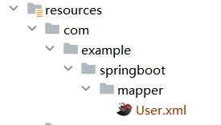

```xml
<?xml version="1.0" encoding="UTF-8" ?>
<!DOCTYPE mapper
        PUBLIC "-//mybatis.org//DTD Mapper 3.0//EN"
        "http://mybatis.org/dtd/mybatis-3-mapper.dtd">
<mapper namespace="com.example.springboot.mapper.UserMapper">
    //	设置namespace目录的【全限定名称】，与Mapper对应！

<!--  查询所有  -->
    <select id="listUser" resultType="com.example.springboot.entity.User">
        //	设置id与UserMapper中方法名！
        //	设置resultType的实体类User！
        select * from user
    </select>

</mapper>
```

2. 取消`UserMapper`中的注解；

   ```java
   @Mapper
   public interface UserMapper {
       /**
        * 查询所有
        * @return
        */  
       
   //	@Select("select * from user")
       List<User> listUser();
   }
   ```

3. 配置`application.yml`

   ```properties
   #配置Mybatis 绑定
   mybatis:
     mapper-locations: classpath:com/example/springboot/mapper/*.xml
   ```

   如果直接创建mapper，只用写`mapper-locations: classpath:mapper/*.xml`

如果没有配置，网页会报错：

```
org.apache.ibatis.binding.BindingException: Invalid bound statement (not found): com.example.springboot.mapper.UserMapper.listUsers
//绑定异常:无效的绑定语句(未找到)
```

# 3、分页&模糊查询(R)

## 3.1 后端

### 3.1.1 代码实现

为了统一后台返回的数据，创建`springboot.common`包，新建`Result.java`进行包装。

```java
package com.example.springboot.common;
import lombok.Data;

/**
 * 统一管理后台的返回的数据
 */
@Data
public class Result {
//    定义常量状态码
    private static final String SUCCESS_CODE = "200";
    private static final String ERROR_CODE = "-1";

//    统一封装返回信息
    private String code;
    private Object data;
    private String msg;

//    成功时调用的无参构造方法
    public static Result success() {
        Result result = new Result();
        result.setCode(SUCCESS_CODE);
        return result;
    }

//    成功时调用的有参构造方法
    public static Result success(Object data) {
        Result result = new Result();
        result.setCode(SUCCESS_CODE);
        result.setData(data);
        return result;
    }

    //    错误时调用的有参构造方法
    public static Result error(String msg) {
        Result result = new Result();
        result.setCode(ERROR_CODE);
        result.setMsg(msg);
        return result;
    }
}
```

修改`UserController`；并且将包下的`listUser`都修改为`list`。

```java
//  查询所有
@GetMapping("/list")
public Result list() {
    List<User> users = userService.list();
    return Result.success(users);
}
```

启动浏览器，访问`http://localhost:9090/user/list`

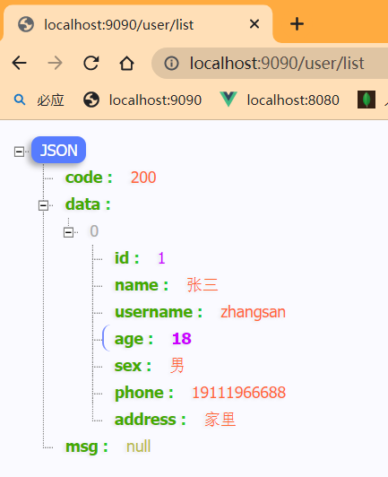

==正式开始分页与模糊查询：（从前往后）==

1. 在`controller.UserController`中

   ```java
   //  分页
   @GetMapping("/page")
   public Result page(UserPageRequest userPageRequest) {
   	return Result.success(userService.page(userPageRequest));
       }
   ```

   - 会需要传递参数，创建`controller.request`来创建实体类类`BaseRequest`和`UserPageRequest`；并且UserPageRequest 继承 BaseRequest。

     ```java
     package com.example.springboot.controller.request;
     import lombok.Data;
     
     @Data
     public class BaseRequest {
         //	页数信息（通用的）
         //	设置默认值，否则报错500，需要手动传入参数
         private Integer pageNum = 1 ;
         private Integer pageSize = 10 ;
     }
     ```

     ```java
     package com.example.springboot.controller.request;
     import lombok.Data;
     
     @Data
     public class UserPageRequest extends BaseRequest{
     	//	模糊查询的字段
         private String name;	
         private String phone;
     }
     ```

2. 在`service.IUserService`中

   ```java
   //  分页
   Object page(UserPageRequest userPageRequest);
   ```

   在`service.impl.UserService`中

   ```java
   //  分页
   @Override
   public Object page(UserPageRequest userPageRequest) {
     
       // 使用插件将其包装成分页对象
      PageHelper.startPage(userPageRequest.getPageNum(),userPageRequest.getPageSize());
       
       //  条件查询listByCondition
       List<User> users = userMapper.listByCondition(userPageRequest);
       return new PageInfo<>(users);
       
   }
   ```

3. 在`mapper.UserMapper`中

   ```java
   /**
    * 条件查询
    * @param userPageRequest
    */
   List<User> listByCondition(UserPageRequest userPageRequest);
   ```

   与`User.xml`保持映射，写入sql语句。

   ```xml
   <!--  条件查询  -->
   <select id="listByCondition" resultType="com.example.springboot.entity.User">
   
   <!--
   导致传入的参数为null的原因，sql语句是静态的，应该采用动态sql语句。
   select * from user where name like concat('%', #{name}, '%') and phone like concat('%', #{phone}, '%');
   -->
   
   -- 动态sql
   select * from user 
   	<where>
   		<if test="name != null and name != ''">
               name like concat('%',#{name},'%')
   		</if>
   		
           <if test="phone != null and phone != ''">
               phone like concat('%',#{phone},'%')
   		</if>
   	</where>
   </select>
   ```

   > 如果使用静态sql，会导致传入的参数为null。
   >
   > ```sh
   > JDBC Connection [HikariProxyConnection@1851731810 wrapping com.mysql.cj.jdbc.ConnectionImpl@5bc3ea85] will not be managed by Spring
   > ==>  Preparing: select * from user where name like concat('%', ?, '%') and phone like concat('%', ?, '%');
   > ==> Parameters: null, null
   > <==      Total: 0
   > ```
   >
   > 动态sql语句的日志信息：
   >
   > ```sh
   > ==>  Preparing: select * from user where name like concat('%', ?, '%') 
   > ==> Parameters: 李四(String)
   > <==      Total: 0
   > ```
   >
   > 动态sql 的好处：**传什么查什么**

访问`http://localhost:9090/user/page`，后端功能已实现。


分页成功的提示：

```sh
JDBC Connection [HikariProxyConnection@695994014 wrapping com.mysql.cj.jdbc.ConnectionImpl@cdd60cf] will not be managed by Spring
==>  Preparing: SELECT count(0) FROM user
==> Parameters: 
<==    Columns: count(0)
<==        Row: 1
<==      Total: 1
==>  Preparing: -- 动态sql select * from user LIMIT ?
==> Parameters: 10(Integer)
<==    Columns: id, name, username, age, sex, phone, address
<==        Row: 1, 张三, zhangsan, 18, 男, 19111966688, 家里
<==      Total: 1
Closing non transactional SqlSession [org.apache.ibatis.session.defaults.DefaultSqlSession@1cbbcb99]
```

### 3.1.2 pagehelper 分页对象

在`service.impl.UserService`中，为了包装分页对象；导入依赖pagehelper。

```xml
<!--    pagehelper    -->
        <dependency>
            <groupId>com.github.pagehelper</groupId>
            <artifactId>pagehelper-spring-boot-starter</artifactId>
            <version>1.4.5</version>
        </dependency>
```

在启动srpingboot时pagehelper成功生效会有提示：

```sh

,------.                           ,--.  ,--.         ,--.                         
|  .--. '  ,--,--.  ,---.   ,---.  |  '--'  |  ,---.  |  |  ,---.   ,---.  ,--.--. 
|  '--' | ' ,-.  | | .-. | | .-. : |  .--.  | | .-. : |  | | .-. | | .-. : |  .--' 
|  | --'  \ '-'  | ' '-' ' \   --. |  |  |  | \   --. |  | | '-' ' \   --. |  |    
`--'       `--`--' .`-  /   `----' `--'  `--'  `----' `--' |  |-'   `----' `--'    
                   `---'                                   `--'                        
is intercepting.
```

### 3.1.3 设置日志

```properties
# 配置Mybatis 绑定
mybatis:
  mapper-locations: classpath:com/example/springboot/mapper/*.xml
  # 打印日志
  configuration:
    log-impl: org.apache.ibatis.logging.stdout.StdOutImpl
```

## 3.2 前端

之前使用`fetch()`去实现的，需要自己去拼接地址，比较麻烦。因此使用`axios`插件，来处理前后端交互的数据。

### 3.2.1  <span id="axios">axios插件的安装</span>

不知道是什么bug、在Terminal终端进入项目的vue目录后，执行安装语句，会报错；经过解决后使用`cmd（管理员）`完成插件的安装。

- 通过cmd，进入到项目中`vue`目录（其实和终端一样）

  ```sh
  C:\Windows\system32>cd H:\GIt-Note\LibraryManagement\vue
  C:\Windows\system32>H:
  H:\GIt-Note\LibraryManagement\vue> 
  ```

- 清除npm缓存：

  ```sh
  npm cache clean --force
  ```

- 安装：

  ```sh
  npm install axios -S
  ```

- 安装成功后，在`vue\package.json`中会添加`axios`依赖：

  ```json
  "dependencies": {
  	"axios": "^1.1.3",
      "core-js": "^3.8.3",
      "element-ui": "^2.15.10",
      "vue": "^2.6.14",
      "vue-router": "^3.5.1"
  }
  ```

- axios封装`request.js`工具类：新建`vue\src\utils`目录。

  ```js
  import axios from 'axios'
  
  const request = axios.create({
      //	设置url
      baseURL: 'http://localhost:9090',  
      timeout: 5000
  })
  
  // request 拦截器
  // 可以自请求发送前对请求做一些处理
  // 比如统一加token，对请求参数统一加密
  request.interceptors.request.use(config => {
      config.headers['Content-Type'] = 'application/json;charset=utf-8';
  
      // config.headers['token'] = user.token;  // 设置请求头
      return config
  }, error => {
      return Promise.reject(error)
  });
  
  // response 拦截器
  // 可以在接口响应后统一处理结果
  request.interceptors.response.use(
      response => {
          let res = response.data;
          // 兼容服务端返回的字符串数据;res中存放的是code,data,msg
          if (typeof res === 'string') {
              res = res ? JSON.parse(res) : res
          }
          return res;
      },
      error => {
          console.log('err' + error) // for debug
          return Promise.reject(error)
      }
  )
  export default request
  ```

### 3.2.2 代码实现

需要对`HomeView.vue`进行增修，以完善功能。

```vue
<template>
  <div>
    <!--    搜索表单    -->
      <div style="margin-bottom: 20px">
        <el-input style="width: 240px" placeholder="请输入名称" v-model="params.name"></el-input>
        <el-input style="width: 240px; margin: 5px" placeholder="请输入联系方式" v-model="params.phone" ></el-input>
        <el-button style="margin-left: 5px" type="primary" @click="load"><i class="el-icon-search"></i>搜索</el-button>
        <el-button style="margin-left: 5px" type="warning" @click="reset"><i class="el-icon-refresh"></i>重置</el-button>
      </div>

    <!--  表头  -->
      <el-table :data="tableData" stripe>
        <el-table-column prop="name" label="名称"></el-table-column>
        <el-table-column prop="age" label="年龄"></el-table-column>
        <el-table-column prop="address" label="地址"></el-table-column>
        <el-table-column prop="phone" label="联系方式"></el-table-column>
        <el-table-column prop="sex" label="性别"></el-table-column>
      </el-table>

    <!-- 分页 -->
    <div style="margin-top: 20px">
      <el-pagination
          background
          :current-page="params.pageNum"
          :page-size="params.pagesize"
          layout="prev, pager, next"
          @current-change="handleCurrentChange"
          :total=total>
      </el-pagination>
    </div>

  </div>
</template>

<script>

//  导入request包，类似于导入axios.js
import request from "@/utils/request";

export default {
  name: 'HomeView',
  data(){
    return {
      tableData: [],
      //  绑定total，默认为0
      total:0,
      //  传入参数
      params: {
        pageNum: 1,
        pagesize: 10,
        name: '',
        phone: ''
      }
    }
  },
  created() {
    this.load()
  },
  methods:{
    //  加载
    load() {
      request.get(
          '/user/page',
          //  传递参数
          {params:this.params})
          .then(res => {
            //  进行判断200再赋值
            if(res.code === '200'){
              //  data.list 才是数据库中的数据
              this.tableData = res.data.list
              //  绑定total
              this.total = res.data.total
            }
          }
      )
    },
    //  重置按钮功能
    reset() {
      this.params = {
        pageNum: 1,
        pagesize: 10,
        name: '',
        phone: ''
      }
      this.load()
    },
    //  点击触发分页效果
    handleCurrentChange(pageNum) {
      this.params.pageNum = pageNum
      this.load()
    }

  }
}
</script>
```

注意点：

1. 搜索表单中：

   ```html
   <!--    搜索表单    -->
   <div style="margin-bottom: 20px">
   	<el-input style="width: 240px" placeholder="请输入名称" v-model="params.name"></el-input>
       -- 需要绑定参数v-model，才能输入！
   	<el-input style="width: 240px; margin: 5px" placeholder="请输入联系方式" v-model="params.phone" ></el-input>
       -- 同上
       
   	<el-button style="margin-left: 5px" type="primary" @click="load"><i class="el-icon-search"></i>搜索</el-button>
       -- 当点击搜索时，无反应，需要查看是否绑定【事件@click】
       
   <el-button style="margin-left: 5px" type="warning" @click="reset"><i class="el-icon-refresh"></i>重置</el-button>
       
   </div>
   ```

2. 分页中：

   ```html
   <!-- 分页 -->
   <div style="margin-top: 20px">
   	<el-pagination>
   		background
           <!--  分页相关的参数pageNum、pagesize -->
   		:current-page="params.pageNum"
   		:page-size="params.pagesize"
   		layout="prev, pager, next"
           <!-- currentPage 改变时会触发 -->
   		@current-change="handleCurrentChange"
   		:total=total>
   	</el-pagination>
   </div>
   ```

# 4、后台增删改(CDU)

调整前端页面；新建`views\user\User.vue`，将之前的HomeView.vue移植过来。

```vue
<template>
  <div>
    <!--    搜索表单    -->
    <div style="margin-bottom: 20px">
      <el-input style="width: 240px" placeholder="请输入姓名" v-model="params.name"></el-input>
      <el-input style="width: 240px; margin: 5px" placeholder="请输入联系方式" v-model="params.phone" ></el-input>
      <el-button style="margin-left: 5px" type="primary" @click="load"><i class="el-icon-search"></i>搜索</el-button>
      <el-button style="margin-left: 5px" type="warning" @click="reset"><i class="el-icon-refresh"></i>重置</el-button>
    </div>

    <!--  表头  -->
    <el-table :data="tableData" stripe>
      <el-table-column prop="id" label="编号"></el-table-column>
      <el-table-column prop="name" label="姓名"></el-table-column>
      <el-table-column prop="age" label="年龄"></el-table-column>
      <el-table-column prop="phone" label="联系方式"></el-table-column>
      <el-table-column prop="sex" label="性别"></el-table-column>
      <el-table-column prop="address" label="地址"></el-table-column>
      <el-table-column prop="createtime" label="创建时间"></el-table-column>
      <el-table-column prop="updatetime" label="更新时间"></el-table-column>

      <!--   操作（编辑&删除）   -->
      <el-table-column label="操作">
        <template v-slot="scope">
        <!--     scope.row 就是当前行数据     -->
          <el-button type="primary" @click="$router.push('/editUser?id=' + scope.row.id)">编辑</el-button>
          <el-popconfirm
              style="margin-left: 8px"
              title="您确定删除吗？"
              @confirm = "del(scope.row.id)">
            <el-button type="danger" slot="reference">删除</el-button>
          </el-popconfirm>
        </template>
      </el-table-column>
    </el-table>

    <!-- 分页 -->
    <div style="margin-top: 20px">
      <el-pagination
          background
          :current-page="params.pageNum"
          :page-size="params.pagesize"
          layout="prev, pager, next"
          @current-change="handleCurrentChange"
          :total=total>
      </el-pagination>
    </div>

  </div>
</template>

<script>

//  导入request包，类似于导入axios.js
import request from "@/utils/request";

export default {
  name: 'User',
    //	此处保持一致
  data(){
    return {
      tableData: [],
      //  绑定total，默认为0
      total:0,
      //  传入参数
      params: {
        pageNum: 1,
        pagesize: 10,
        name: '',
        phone: ''
      }
    }
  },
  created() {
    this.load()
  },
  methods:{
    //  加载
    load() {
      request.get(
          '/user/page',
          //  传递参数
          {params:this.params})
          .then(res => {
                //  进行判断200再赋值
                if(res.code === '200'){
                  //  data.list 才是数据库中的数据
                  this.tableData = res.data.list
                  //  绑定total
                  this.total = res.data.total
                }
              }
          )
    },
    //  重置按钮功能
    reset() {
      this.params = {
        pageNum: 1,
        pagesize: 10,
        name: '',
        phone: ''
      }
      this.load()
    },
    //  点击触发分页效果
    handleCurrentChange(pageNum) {
      this.params.pageNum = pageNum
      this.load()
      // console.log(pageNum)
    },
    //  删除按钮功能
    del(id) {
      request.delete("user/delete/" + id).then(res => {
        if(res.code === '200') {
          this.$notify.success('删除成功')
          this.load()
        } else {
          this.$notify.error(res.msg)
        }
          })
    }

  }
}
</script>
<style scoped>
</style>
```

1. 表头新增`id`(编号)、`createtime`(创建时间)、`updatetime`(更新时间)；
2. 新增==操作==（编辑和删除按钮）；
3. 当实现删除按钮时，使用`methods:{}`中的`del()`方法。

在`index.js`中添加路由：

```js
  {
    path: '/user',
    name: 'User',
    component: () => import('@/views/user/User')
  },
```

在`App.vue`中对侧边导航进行微调：

```vue
<!--    侧边栏导航    -->
      <div style="width: 200px;
      min-height: calc(100vh - 82px);
      /*最小行高 100vh占满全屏，82px = 头部height80px + margin-bottom 2px */
      overflow: hidden;
      margin-right: 2px;
      background-color: white">
      <el-menu
          :default-active="$route.path === '/'? $route.path : $route.path.substring(1)"
          :default-openeds="['/']"
          router class="el-menu-demo">

        <el-menu-item index="/">
          <i class="el-icon-s-platform"></i>
          <span>首页</span>
        </el-menu-item>


        <el-submenu index="/">
          <template slot="title">
            <i class="el-icon-more"></i>
            <span>会员管理</span>
          </template>
          <el-menu-item index="addUser">添加会员</el-menu-item>
          <el-menu-item index="user">会员列表</el-menu-item>
          </el-submenu>

        <el-menu-item index="3" disabled>消息中心</el-menu-item>
      </el-menu>
      </div>
```

## 4.1 添加

### 4.1.1 前端

在`index.js`中添加`addUser`路由：

```js
  {
    path: '/addUser',
    name: 'addUser',
    component: () => import('@/views/user/addUser')
  },
```

新建`user\addUser.vue`页面：

```vue
<template>
    <!-- 新增表单 -->
  <div style="margin: 20px;width: 300px">
    <h2 style="margin-bottom: 30px">新增用户</h2>
  <el-form label-width="80px" ref="form" :model="form">
    <el-form-item label="姓名" prop="name">
      <el-input v-model="form.name" placeholder="请输入姓名"></el-input>
    </el-form-item>
    <el-form-item label="年龄" prop="age">
      <el-input v-model="form.age" placeholder="请输入年龄"></el-input>
    </el-form-item>
    <el-form-item label="联系方式" prop="phone">
      <el-input v-model="form.phone" placeholder="请输入联系方式"></el-input>
    </el-form-item>
    <el-form-item label="性别" prop="sex">
      <el-input v-model="form.sex" placeholder="请输入性别"></el-input>
    </el-form-item>
    <el-form-item label="地址" prop="address">
      <el-input v-model="form.address" placeholder="请输入姓名"></el-input>
    </el-form-item>
  </el-form>

      <!--  按钮  -->
    <div style="text-align: center;margin-top: 30px">
      <el-button type="primary" @click="sava">提交</el-button>
    </div>

  </div>
</template>

<script>

//	导入request
import request from "@/utils/request";

export default {
  name: "addUser",
  data() {
    return {
      form: {}
    }
  },
  methods: {
    //  新增表单（关联后端）
    sava() {
      request.post('/user/sava', this.form).then(
          res => {
            if (res.code === '200') {
              this.$notify.success('新增成功')
              this.form = {}
            } else {
              this.$notify.error(res.msg)
            }
          })
    },

  }
}
</script>
<style scoped>
</style>
```

### 4.1.2 后端

1. `controller`，通过post请求；

   ```java
   //  添加
   @PostMapping("/sava")   
   //这里不加/sava，也可以直接通过"/"访问
   public Result save(@RequestBody User user) {
   	userService.sava(user);
   	return Result.success();
   }
   ```

2. `service`包下

   在`IUserService`中

   ```java
       //  添加
       void sava(User user);
   ```

   在`UserService`中，通过导入依赖实现`username`成为唯一的号码——`hutool`

   ```java
   //  添加
   @Override
   public void sava(User user) {
   	Date date = new Date();
           //  生成卡号（当前时间 + 随机6位数字）
           user.setUsername(DateUtil.format(date,"yyyMMdd") + RandomUtil.randomNumbers(6));
           userMapper.sava(user);
       }
   ```

   - `pom.xml`添加依赖

     ```xml
     <!--    UID-hutool    -->
     	<dependency>
     		<groupId>cn.hutool</groupId>
     		<artifactId>hutool-all</artifactId>
     		<version>5.8.0</version>
     	</dependency>
     ```

3. `UserMapper`中

   ```java
       /**
        * 添加
        * @param user
        */
       void sava(User user);
   ```

   `User.xml`中

   ```xml
   <!--  添加  -->
   <insert id="sava">
           insert into user(name,username,age,sex,phone,address)
           values (#{name},#{username},#{age},#{sex},#{phone},#{address})
    </insert>
   ```

### 4.1.3 SQL表

新增两个属性`reatetime`和`updatetime`；设置`reatetime`特性为`CURRENT_TIMESTAMP`，字段默认值为当前时间。


添加新属性后，实体类`entity\User`中的代码页需要添加：

```java
@JsonFormat(pattern = "yyyy-MM-dd",timezone = "GMT+8")
private Date createtime;
@JsonFormat(pattern = "yyyy-MM-dd",timezone = "GMT+8")
private Date updatetime;
```

## 4.2 更新

### 4.2.1 前端

在`index.js`中添加`editUser`路由：

```js
  {
    path: '/editUser',
    name: 'editUser',
    component: () => import('@/views/user/editUser')
  }
```

创建`editUser.vue`，类似于添加页面，基本相同。

```vue
<template>
  <div style="margin: 20px;width: 300px">
    <h2 style="margin-bottom: 30px">编辑用户</h2>
  <el-form label-width="80px" ref="form" :model="form">
    <el-form-item label="姓名" prop="name">
      <el-input v-model="form.name" placeholder="请输入姓名"></el-input>
    </el-form-item>
    <el-form-item label="年龄" prop="age">
      <el-input v-model="form.age" placeholder="请输入年龄"></el-input>
    </el-form-item>
    <el-form-item label="联系方式" prop="phone">
      <el-input v-model="form.phone" placeholder="请输入联系方式"></el-input>
    </el-form-item>
    <el-form-item label="性别" prop="sex">
      <el-input v-model="form.sex" placeholder="请输入性别"></el-input>
    </el-form-item>
    <el-form-item label="地址" prop="address">
      <el-input v-model="form.address" placeholder="请输入姓名"></el-input>
    </el-form-item>
  </el-form>

      <!--  按钮  -->
    <div style="text-align: center;margin-top: 30px">
      <el-button type="primary" @click="update">提交</el-button>
<!--      <el-button type="warning" @click="resetForm">重置</el-button>-->
    </div>

  </div>
</template>

<script>

import request from "@/utils/request";

export default {
  name: "addUser",
  data() {
    return {
      form: {}
    }
  },
    //	根据id查询的页面
  created() {
    const id = this.$route.query.id
    request.get("/user/" + id).then(res => {
      this.form = res.data
    })
  },
  methods: {
    //  更新
    update() {
      request.put('/user/update', this.form).then(
          res => {
            if (res.code === '200') {
              this.$notify.success('更新成功')
              this.$router.push("/user")
            } else {
              this.$notify.error(res.msg)
            }
          })
    },
  }
}
</script>
<style scoped>
</style>
```

### 4.2.2 后端

方便写笔记，根据==id查询==与更新写在一起。

1. `controller`包

   ```java
       //  修改（根据id查询）
       @GetMapping("/{id}")
       public Result getById(@PathVariable Integer id) {
           User user = userService.getById(id);
           return Result.success(user);
       }
   
       //  更新
       @PutMapping("/update")
       public Result update(@RequestBody User user) {
           userService.update(user);
           return Result.success();
       }
   ```

2. `service`包下

   在`IUserService`中：

   ```java
       //  修改（根据id查询）
       User getById(Integer id);
   
       //  更新
       void update(User user);
   ```

   在`UserService`中：

   ```java
       //  修改（根据id查询）
       @Override
       public User getById(Integer id) {
           return userMapper.getById(id);
       }
   
       //  更新
       @Override
       public void update(User user) {
           user.setUpdatetime(new Date());
           userMapper.updateById(user);
       }
   ```

3. `UserMapper`中

   ```java
       /**
        * 根据id查询
        * @param id
        * @return
        */
       User getById(Integer id);
   
       /**
        * 更新
        * @param user
        */
       void updateById(User user);
   ```

   `User.xml`中

   ```xml
       <!--  修改（根据id查询）  -->
       <select id="getById" resultType="com.example.springboot.entity.User">
           select * from user where id = #{id}
       </select>
   
       <!--  更新  -->
       <update id="updateById">
           update user set name = #{name},age = #{age},sex = #{sex},phone = #{phone}, address = #{address}, updatetime = #{updatetime}
           where id = #{id}
       </update>
   ```

## 4.3 删除

### 4.3.1 前端

因为删除在操作中，位于`User.vue`中：

- 实现删除按钮：

```vue
      <!--   操作（编辑&删除）   -->
      <el-table-column label="操作">
        <template v-slot="scope">
        <!--     scope.row 就是当前行数据     -->
          <el-button type="primary" @click="$router.push('/editUser?id=' + scope.row.id)">编辑</el-button>
          <el-popconfirm
              style="margin-left: 8px"
              title="您确定删除吗？"
              @confirm = "del(scope.row.id)">
            <el-button type="danger" slot="reference">删除</el-button>
          </el-popconfirm>
        </template>
      </el-table-column>
```

- 关联后端：

```javascript
    //  删除按钮功能
    del(id) {
      request.delete("user/delete/" + id).then(res => {
        if(res.code === '200') {
          this.$notify.success('删除成功')
          this.load()
        } else {
          this.$notify.error(res.msg)
        }
          })
    }
```

### 4.3.2 后端

1. `controller`包，删除和更新相同，根据id进行删除。

   ```java
       //  删除
       @DeleteMapping("/delete/{id}")
       public Result delete(@PathVariable Integer id) {
           userService.deleteById(id);
           return Result.success();
       }
   ```

2. `service`包下

   在`IUserService`中：

   ```java
   	//  删除
       void deleteById(Integer id);
   ```

   在`UserService`中：

   ```java
       //  删除
       @Override
       public void deleteById(Integer id) {
           userMapper.deleteById(id);
       }
   ```

3. `UserMapper`中

   ```java
       /**
        * 删除
        * @param id
        */
       void deleteById(Integer id);
   ```

   `User.xml`中

   ```xml
       <!--  删除  -->
       <delete id="deleteById">
           delete from user where id = #{id}
       </delete>
   ```

## 4.4 小结

```java
//	增
@PostMapping

//	删
@DeleteMapping

//	改
@PutMapping

//	查
@GetMapping
```

==_**400就是前端的问题，500就是后端的问题**_==

# 5、表单校验

为了贴合实际，将会对表单数据进行验证，对代码进行优化。（包括：新增用户时对年龄进行判断、联系方式手机号的规定、性别采用单选框）

[https://element.eleme.cn/#/zh-CN/component/form](表单验证)

- 在`editUser`中，表头添加会员卡号`username`，并且设置为不可修改。

  ```vue
  <el-form-item label="会员卡号" prop="name">
  	<el-input v-model="form.username" disabled></el-input>
  </el-form-item>
  ```

  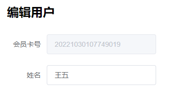

- 修改性别`sex`为单选框，并且设置_男_为默认选中。

  ```vue
  <el-form-item label="性别" prop="sex">
  	<el-radio v-model="form.sex" aria-checked="男">男</el-radio>
  	<el-radio v-model="form.sex" label="女">女</el-radio>
  </el-form-item>
  ```

  `aria-checked="男"`相当于`label="男"`吧，后者存在，前者不生效。`addUser`和`editUser`类似相同修改。

- 在`addUser`中，进行表单验证：

  >Form 组件提供了表单验证的功能，只需要通过 `rules` 属性传入约定的验证规则，并将 Form-Item 的 `prop` 属性设置为需校验的字段名即可。

1. 姓名验证：

   ```vue
   <el-form-item label="姓名" prop="name">
   	<el-input v-model="form.name" placeholder="请输入姓名"></el-input>
   </el-form-item>
   ```

   ```javascript
   data() {
       return {
         form: {},
   
         rules: {
   //	此处的name和prop设置的属性对应
           name: [
             { required: true, message: '请输入姓名', trigger: 'blur' },
           ]
           //age : [{...}]       
         },
   
         ruleForm: {
           name: ''
         },
       }
     },
   ```

2. 年龄验证：

   ```vue
   <el-form-item label="年龄" prop="age">
   	<el-input v-model="form.age" placeholder="请输入年龄"></el-input>
   </el-form-item>
   ```

   ```javascript
   data {
   	//  验证年龄数据
       const checkAge = (rule,value,callback) => {
         if (!value) {
           return callback(new Error('年龄不能为空'));
         }
         if (!/^[0-9]+$/.test(value)) {
           callback(new Error('请输入数字'));
         }
         if (parseInt(value) > 120 || parseInt(value) <= 0) {
           callback(new Error('请输入合理的年龄'));
         }
         callback()
       };
   ...
   }
   ```

   ```javascript
   age: [
   		{ validator: checkAge, trigger: 'blur' }
   	 ],
   ```

3. 验证联系方式

   ```vue
   <el-form-item label="联系方式" prop="phone">
         <el-input v-model="form.phone" placeholder="请输入联系方式"></el-input>
   </el-form-item>
   ```

   ```javascript
   //  验证联系方式
       const checkPhone = (rule, value, callback) => {
         if (!/^[1][3,4,5,6,7,8,9][0-9]{9}$/.test(value)) {
           callback(new Error('请输入合法的手机号'));
         }
         callback()
   	};
   ```

   ```javascript
   phone: [
   		{ validator: checkPhone, trigger: 'blur' }
   	   ]
   ```

- 修改代码——清空表单数据

  ```javascript
      sava() {
        this.$refs['ruleForm'].validate((valid) => {
          if (valid) {
            request.post('/user/sava', this.form).then(
                res => {
                  if (res.code === '200') {
                    this.$notify.success('新增成功')
                    this.$refs['ruleForm'].resetFields()
                      //	this.form={}
                  } else {
                    this.$notify.error(res.msg)
                  }
                })
          }
        })
      },
  ```

- 在新增界面实现了重置按钮（解决了我早上没有实现的功能！！简直是重大突破🙂）

  ```vue
  <el-button type="warning" @click="resetForm('ruleForm')">重置</el-button>
  ```

  ```javascript
  resetForm(ruleForm) {
  	this.$refs['ruleForm'].resetFields();
  }
  ```

  > ​	一定要修改`formName`的值，即在最上面定义的`ref="ruleForm"`的值！

# 6、克隆模块-管理员Admin

完成管理员`admin`代码，与用户相同，小略。

## 6.1 数据库Mysql

```sql
SET FOREIGN_KEY_CHECKS=0;
-- ----------------------------
-- Table structure for admin
-- ----------------------------
DROP TABLE IF EXISTS `admin`;
CREATE TABLE `admin` (
  `id` int(11) NOT NULL AUTO_INCREMENT,
  `username` varchar(255) COLLATE utf8mb4_unicode_ci DEFAULT NULL COMMENT '用户名',
  `phone` varchar(255) COLLATE utf8mb4_unicode_ci DEFAULT NULL COMMENT '联系方式',
  `password` varchar(30) COLLATE utf8mb4_unicode_ci DEFAULT NULL COMMENT '密码',
  `email` varchar(255) COLLATE utf8mb4_unicode_ci DEFAULT NULL COMMENT '邮箱',
  `createtime` datetime DEFAULT CURRENT_TIMESTAMP COMMENT '创建时间',
  `updatetime` datetime DEFAULT NULL,
  PRIMARY KEY (`id`)
) ENGINE=InnoDB AUTO_INCREMENT=21 DEFAULT CHARSET=utf8mb4 COLLATE=utf8mb4_unicode_ci;
```

## 6.2  后端

新增大体结构：

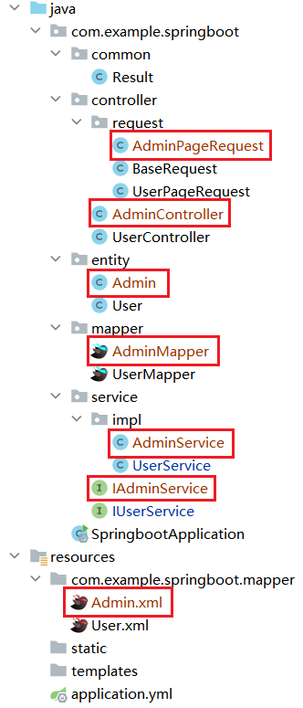

### 6.2.1 代码实现

- `AdminPageRequest`

```java
package com.example.springboot.controller.request;

import lombok.Data;

@Data
public class AdminPageRequest extends BaseRequest{
    private String username;
    private String phone;
    private String email;
}
```

- `Admin`：

```java
package com.example.springboot.entity;

import com.fasterxml.jackson.annotation.JsonFormat;
import lombok.Data;

import java.util.Date;

@Data
public class Admin {
    private Integer id;
    private String username;
    private String phone;
    private String email;
    private String password;
    @JsonFormat(pattern = "yyyy-MM-dd",timezone = "GMT+8")
    private Date createtime;
    @JsonFormat(pattern = "yyyy-MM-dd",timezone = "GMT+8")
    private Date updatetime;
}
```

- `AdminMapper`

```java
package com.example.springboot.mapper;

import com.example.springboot.controller.request.BaseRequest;
import com.example.springboot.entity.Admin;
import org.apache.ibatis.annotations.Mapper;

import java.util.List;

@Mapper
public interface AdminMapper {
    //  查询所有
    List<Admin> list();

    //  条件查询（多态的方式）
    List<Admin> listByCondition(BaseRequest baseRequest);

    //  添加
    void sava(Admin admin);

    //  根据id查询
    Admin getById(Integer id);

    //  更新
    void updateById(Admin admin);

    //  删除
    void deleteById(Integer id);
}
```

- `Admin.xml`

```java
<?xml version="1.0" encoding="UTF-8" ?>
<!DOCTYPE mapper
        PUBLIC "-//mybatis.org//DTD Mapper 3.0//EN"
        "http://mybatis.org/dtd/mybatis-3-mapper.dtd">
<mapper namespace="com.example.springboot.mapper.AdminMapper">

    <!--  查询所有  -->
    <select id="list" resultType="com.example.springboot.entity.Admin">
        select * from admin
        order by id desc;
    </select>

    <!--  条件查询  -->
    <select id="listByCondition" resultType="com.example.springboot.entity.Admin">
        select * from admin
        <where>
            <if test="username != null and username != ''">
                username like concat('%', #{username}, '%')
            </if>
            <if test="phone != null and phone != ''">
                and phone  like concat('%', #{ phone }, '%')
            </if>
            <if test="email != null and email != ''">
                and email  like concat('%', #{email}, '%')
            </if>
        </where>
        order by id desc
    </select>

    <!--  添加  -->
    <insert id="sava">
        insert into admin(username,password,phone,email)
        values (#{username},#{password},#{phone},#{email})
    </insert>

    <!--  修改(根据id查询)  -->
    <select id="getById" resultType="com.example.springboot.entity.Admin">
        select * from admin where id = #{id}
    </select>

    <!--  更新  -->
    <update id="updateById">
        update admin set
            username = #{username},phone = #{phone},email = #{email},updatetime = #{updatetime}
            where id =#{id}
    </update>

    <!--  删除  -->
    <delete id="deleteById">
        delete from admin where id = #{id}
    </delete>
        
</mapper>
```

- `IAdminService`

```java
package com.example.springboot.service;

import com.example.springboot.controller.request.BaseRequest;
import com.example.springboot.entity.Admin;
import com.github.pagehelper.PageInfo;

import java.util.List;

public interface IAdminService {
    //  查询所有
    List<Admin> list();

    //  分页
    PageInfo<Admin> page(BaseRequest baseRequest);

    //  添加
    void save(Admin admin);

    //  根据id查询
    Admin getById(Integer id);

    //  更新
    void update(Admin admin);

    //  删除
    void deleteById(Integer id);

}
```

- `AdminService`

```java
package com.example.springboot.service.impl;

import com.example.springboot.controller.request.BaseRequest;
import com.example.springboot.entity.Admin;
import com.example.springboot.entity.User;
import com.example.springboot.mapper.AdminMapper;
import com.example.springboot.service.IAdminService;
import com.github.pagehelper.PageHelper;
import com.github.pagehelper.PageInfo;
import org.springframework.beans.factory.annotation.Autowired;
import org.springframework.stereotype.Service;

import java.util.Date;
import java.util.List;

@Service
public class AdminService implements IAdminService {

    @Autowired
    AdminMapper adminMapper;

    //  查询所有
    @Override
    public List<Admin> list() {
        return adminMapper.list();
    }

    //  分页
    @Override
    public PageInfo<Admin> page(BaseRequest baseRequest) {
        PageHelper.startPage(baseRequest.getPageNum(), baseRequest.getPageSize());
        List<Admin> admins = adminMapper.listByCondition(baseRequest);
        return new PageInfo<>(admins);
    }

    //  添加
    @Override
    public void save(Admin admin) {
        adminMapper.sava(admin);
    }

    //  根据id查询
    @Override
    public Admin getById(Integer id) {
        return adminMapper.getById(id);
    }

    //  更新
    @Override
    public void update(Admin admin) {
        admin.setUpdatetime(new Date());
        adminMapper.updateById(admin);
    }

    //  删除
    @Override
    public void deleteById(Integer id) {
        adminMapper.deleteById(id);
    }
}
```

- `AdminController`

```java
package com.example.springboot.controller;

import com.example.springboot.common.Result;
import com.example.springboot.controller.request.AdminPageRequest;
import com.example.springboot.entity.Admin;
import com.example.springboot.service.IAdminService;
import org.springframework.beans.factory.annotation.Autowired;
import org.springframework.web.bind.annotation.*;

import java.util.List;

@RestController
@CrossOrigin    //  跨域
@RequestMapping("/admin")
public class AdminController {
    @Autowired
    IAdminService adminService;

    //  查询所有
    @GetMapping("/list")
    public Result list() {
        List<Admin> list = adminService.list();
        return Result.success(list);
    }

    //  分页
    @GetMapping("/page")
    public Result page(AdminPageRequest adminPageRequest) {
        return Result.success(adminService.page(adminPageRequest));
    }

    //  添加
    @PostMapping("/sava")   //这里不加，也可以直接通过"/"访问
    public Result save(@RequestBody Admin admin) {
        adminService.save(admin);
        return Result.success();
    }

    //  （根据id查询）
    @GetMapping("/{id}")
    public Result getById(@PathVariable Integer id) {
        Admin admin = adminService.getById(id);
        return Result.success(admin);
    }

    //  更新
    @PutMapping("/update")
    public Result update(@RequestBody Admin admin) {
        adminService.update(admin);
        return Result.success();
    }

    //  删除
    @DeleteMapping("/delete/{id}")
    public Result delete(@PathVariable Integer id) {
        adminService.deleteById(id);
        return Result.success();
    }
}
```

### 6.2.2 Bug需注意

1. 各种注解一定不能少：如：

   ```java
   @Mapper
   public interface AdminMapper {
       ...
   }
   
   @Service
   public class AdminService implements IAdminService {
       ...
   }
   //	等
   ```

2. 小心跨域错误问题，`@CrossOrigin `；

3. `xml`中的sql语句一定仔细！

## 6.3 前端

大体结构：

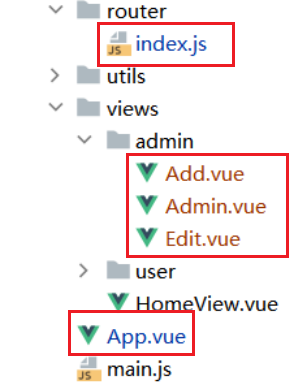

由于需要新增页面，需要对侧边导航栏`App.vue`进行添加、实现与user相同的新增、更新、列表等，需要对路由`index.js`进行添加。

### 6.3.1 代码实现

- `App.vue`

```vue
<template>
  <div id="app">
    <!--  头部  -->
    <div style="height: 80px;line-height: 80px;background: white;margin-bottom: 2px">
      
      <span style="margin-left: 28px;font-size: 24px;font-family: 黑体">青龙山图书管理系统</span>
    </div>

    <!--  侧边栏和主体  -->
    <div style="display: flex">
        <!--    侧边栏导航    -->
      <div style="width: 200px;
      min-height: calc(100vh - 82px);
      /*最小行高 100vh占满全屏，82px = 头部height80px + margin-bottom 2px */
      overflow: hidden;
      margin-right: 2px;
      background-color: white">
      <el-menu
          :default-active="$route.path" router class="el-menu-demo">

        <el-menu-item index="/">
          <i class="el-icon-s-home"></i>
          <span>首页</span>
        </el-menu-item>

        <el-submenu index="user">
          <template slot="title">
            <i class="el-icon-user"></i>
            <span>会员管理</span>
          </template>
          <el-menu-item index="/addUser">添加会员</el-menu-item>
          <el-menu-item index="/userList">会员列表</el-menu-item>
          </el-submenu>

        <el-submenu index="admin">
          <template slot="title">
            <i class="el-icon-user-solid"></i>
            <span>管理员管理</span>
          </template>
          <el-menu-item index="/Add">添加管理员</el-menu-item>
          <el-menu-item index="/adminList">管理员列表</el-menu-item>
        </el-submenu>

        <el-menu-item index="aboutMore" disabled>
          <i class="el-icon-question"></i>
          <span>项目详情</span>
        </el-menu-item>

      </el-menu>

      </div>

        <!--   主体数据   -->
      <div style="flex: 1;background-color: white">
        <router-view/>

      </div>
    </div>
  </div>
</template>
```

- `index.js`

```js
/**
   *  管理员admin路由
   */

  {
    path: '/adminList',
    name: 'AdminList',
    component: () => import('@/views/admin/Admin')
  },
  {
    path: '/Add',
    name: 'Add',
    component: () => import('@/views/admin/Add')
  },
  {
    path: '/Edit',
    name: 'Edit',
    component: () => import('@/views/admin/Edit')
  }
```

- `admin\Add.vue`

```vue
<template>
  <div>
    <!-- 新增表单 -->
    <div style="margin: 20px;width: 300px">
      <h2 style="margin-bottom: 30px">新增管理员</h2>
      <el-form label-width="80px" :model="form" :rules="rules" ref="ruleForm">
        <el-form-item label="用户名" prop="username">
          <el-input v-model="form.username" placeholder="请输入用户名"></el-input>
        </el-form-item>
        <el-form-item label="联系方式" prop="phone">
          <el-input v-model="form.phone" placeholder="请输入联系方式"></el-input>
        </el-form-item>
        <el-form-item label="邮箱" prop="email">
          <el-input v-model="form.email" placeholder="请输入邮箱"></el-input>
        </el-form-item>
      </el-form>

      <!--  按钮  -->
      <div style="text-align: center;margin-top: 30px">
        <el-button type="primary" @click="sava">提交</el-button>
        <el-button type="warning" @click="resetForm('ruleForm')">重置</el-button>
      </div>

    </div>
  </div>
</template>

<script>

import request from "@/utils/request";

export default {
  name: "Add",
  data() {
    //  验证联系方式
    const checkPhone = (rule, value, callback) => {
      if (!/^[1][3,4,5,6,7,8,9][0-9]{9}$/.test(value)) {
        callback(new Error('请输入合法的手机号'));
      }
      callback()
    };

    return {
      form: {},

      ruleForm: {
        username: '',
        phone: '',
        email: ''
      },

      rules: {
        //	此处的name、age、phone和prop设置的属性对应
        username: [
          { required: true, message: '请输入用户名', trigger: 'blur' },
          { min: 3, max: 10, message: '长度在 3 到 5 个字符', trigger: 'blur' }
        ],

        //  验证联系方式
        phone: [
          { validator: checkPhone, trigger: 'blur' }
        ],

        //  验证邮箱
        email: [
          // { required: true, message: '请输入邮箱地址', trigger: 'blur' },
          { type: 'email', message: '请输入正确的邮箱地址', trigger: ['blur', 'change'] }
        ]
      },

    }
  },

  methods: {
    //  添加数据（连接后台）
    sava() {
      this.$refs['ruleForm'].validate((valid) => {
        if (valid) {
          request.post('/admin/sava', this.form).then(
              res => {
                if (res.code === '200') {
                  this.$notify.success('新增成功')
                  this.$refs['ruleForm'].resetFields()
                } else {
                  this.$notify.error(res.msg)
                }
              })
        }
      })
    },
    resetForm(ruleForm) {
      this.$refs['ruleForm'].resetFields();
    }
  }

}

</script>

<style scoped>

</style>
```

- `admin\Edit.vue`

```vue
<template>
  <div>
    <div style="margin: 20px;width: 300px">
      <h2 style="margin-bottom: 30px">编辑管理员</h2>
      <el-form label-width="80px" ref="form" :model="form">
        <el-form-item label="用户名" prop="username">
          <el-input v-model="form.username" disabled></el-input>
        </el-form-item>
        <el-form-item label="联系方式" prop="phone">
          <el-input v-model="form.phone" placeholder="请输入联系方式"></el-input>
        </el-form-item>
        <el-form-item label="邮箱" prop="email">
          <el-input v-model="form.email" placeholder="请输入地址"></el-input>
        </el-form-item>
      </el-form>

      <!--  按钮  -->
      <div style="text-align: center;margin-top: 30px">
        <el-button type="primary" @click="update">提交修改</el-button>
      </div>

    </div>
  </div>
</template>

<script>
import request from "@/utils/request";

export default {
  name: "Edit",
  data() {
    return {
      form: {}
    }
  },

  created() {
    const id = this.$route.query.id
    request.get("/admin/" + id).then(res => {
      this.form = res.data
    })
  },

  methods: {
    //  更新表单
    update() {
      request.put('/admin/update', this.form).then(
          res => {
            if (res.code === '200') {
              this.$notify.success('更新成功')
              this.$router.push("/adminList")
            } else {
              this.$notify.error(res.msg)
            }
          })
    },
  }
}
</script>

<style scoped>

</style>
```

- `admin\Admin.vue`

```vue
<template>
  <div>
    <!--    搜索表单    -->
    <div style="margin-bottom: 10px;margin-top: 10px;margin-left: 10px">
      <el-input style="width: 240px" placeholder="请输入用户名" v-model="params.username"></el-input>
      <el-input style="width: 240px; margin: 6px" placeholder="请输入联系方式" v-model="params.phone" ></el-input>
      <el-input style="width: 240px;" placeholder="请输入邮箱" v-model="params.email" ></el-input>
      <el-button style="margin-left: 8px" type="primary" @click="load"><i class="el-icon-search"></i>搜索</el-button>
      <el-button style="margin-left: 6px" type="warning" @click="reset"><i class="el-icon-refresh"></i>重置</el-button>
    </div>

    <!--  表头  -->
    <el-table :data="tableData" stripe>
      <el-table-column prop="id" label="编号" width="60"></el-table-column>
      <el-table-column prop="username" label="用户名" width="150"></el-table-column>
      <el-table-column prop="phone" label="联系方式"></el-table-column>
      <el-table-column prop="email" label="邮箱"></el-table-column>
      <el-table-column prop="createtime" label="创建时间"></el-table-column>
      <el-table-column prop="updatetime" label="更新时间"></el-table-column>

      <!--   操作（编辑&删除）   -->
      <el-table-column label="操作">
        <template v-slot="scope">
          <!--     scope.row 就是当前行数据     -->
          <el-button type="primary" @click="$router.push('/Edit?id=' + scope.row.id)" class="el-icon-setting">编辑</el-button>
          <el-popconfirm
              style="margin-left: 8px"
              title="您确定删除吗？"
              @confirm = "del(scope.row.id)">
            <el-button type="danger" slot="reference" class="el-icon-delete">删除</el-button>
          </el-popconfirm>
        </template>
      </el-table-column>
    </el-table>

    <!-- 分页 -->
    <div style="margin-top: 20px">
      <el-pagination
          background
          :current-page="params.pageNum"
          :page-size="params.pagesize"
          layout="prev, pager, next"
          @current-change="handleCurrentChange"
          :total=total>
      </el-pagination>
    </div>
  </div>

</template>

<script>
//  导入request包
import request from "@/utils/request";

export default {
  name: "Admin",
  data(){
    return {
      tableData: [],
      //  绑定total，默认为0
      total:0,
      //  传入参数
      params: {
        pageNum: 1,
        pagesize: 10,
        name: '',
        phone: '',
        email: ''
      }
    }
  },
  created() {
    this.load()
  },
  methods:{
    //  加载
    load() {
      request.get(
          '/admin/page',
          //  传递参数
          {params:this.params})
          .then(res => {
                //  进行判断200再赋值
                if(res.code === '200'){
                  //  data.list 才是数据库中的数据
                  this.tableData = res.data.list
                  //  绑定total
                  this.total = res.data.total
                }
              }
          )
    },
    //  重置按钮功能
    reset() {
      this.params = {
        pageNum: 1,
        pagesize: 10,
        name: '',
        phone: '',
        email: ''
      }
      this.load()
    },
    //  点击触发分页效果
    handleCurrentChange(pageNum) {
      this.params.pageNum = pageNum
      this.load()
      // console.log(pageNum)
    },
    //  删除按钮功能
    del(id) {
      request.delete("admin/delete/" + id).then(res => {
        if(res.code === '200') {
          this.$notify.success('删除成功')
          this.load()
        } else {
          this.$notify.error(res.msg)
        }
      })
    }

  }
}
</script>

<style scoped>

</style>
```

### 6.3.2 Bug需注意

1. Vue报错`Error compiling template: Component template should contain exactly one root element. If you`；`<template>`模板下只包含一个标签元素，而不是两个甚至多个。

   ```vue
   <template>
       <div>
           <h2>{{cmessage}}</h2>
           <p>...</p>
       </div>
   </template>
   ```

2. 属性一定需要对照，功能方面，官方文档一般都能解决。

# 7、登录

## 7.1 前端

### 7.1.1 调整路由结构

`route\index.js`

```java
import Vue from 'vue'
import VueRouter from 'vue-router'
import Layout from '@/views/Layout'

Vue.use(VueRouter)

const routes = [
  /*
   *  父级：登录页面
   */
  {
    path: '/login',
    name: 'Login',
    component: () => import('@/views/login/Login')
  },

  //  父级：主页(头部 + 侧边栏)
  {
    path: '/',
    name: 'home',
    component: Layout,
    redirect: '/home',   //重定向到首页！
    children : [
    //  子级会自动拼接path中的'/',因此子路由children不需要加'/'
      //  首页
      {
        path: 'home',
        name: 'Home',
        component: () => import('@/views/home/HomeView')
      },

      //  用户管理user路由

      {
        path: 'userList',
        name: 'UserList',
        component: () => import('@/views/user/User')
      },
      {
        path: 'addUser',
        name: 'addUser',
        component: () => import('@/views/user/addUser')
      },
      {
        path: 'editUser',
        name: 'editUser',
        component: () => import('@/views/user/editUser')
      },

      //  管理员admin路由

      {
        path: 'adminList',
        name: 'AdminList',
        component: () => import('@/views/admin/Admin')
      },
      {
        path: 'Add',
        name: 'Add',
        component: () => import('@/views/admin/Add')
      },
      {
        path: 'Edit',
        name: 'Edit',
        component: () => import('@/views/admin/Edit')
      }

    ]
  }
]

const router = new VueRouter({
  mode: 'history',
  base: process.env.BASE_URL,
  routes
})

export default router
```

注意点：

1. 跳转前后地址栏地址会发生变化，使用重定向。（重定向与转发的特点）
2. 在设置了子路由`children: []`后，子路由中的`'/'`应该去除，父级会拼接`/`的。

### 7.1.2 页面调整及登录页面

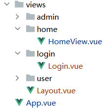

新建`login\Login.vue`，将主页修改为`Layout`；之前是放在`App.vue`中的，`HomeView.vue`只是放在文件中。

`login.vue`：

- ```vue
  <template>
    <div style="height: 100vh ; overflow: hidden">
      <div style="width: 500px; height: 400px;background-color: white;border-radius: 10px;margin: 150px auto;padding: 50px">
        <div style="margin: 30px;text-align: center;  font-size: 30px; font-weight: bold;color: dodgerblue">
          <span>登　录</span>
          <el-form :model="admin" ref="loginForm">
  
            <el-form-item prop="username">
              <el-input placeholder="请输入用户名" prefix-icon="el-icon-user" seiz="medium" v-model="admin.username"></el-input>
            </el-form-item>
  
            <el-form-item prop="password">
              <el-input placeholder="请输入密码" prefix-icon="el-icon-lock" seiz="medium" v-model="admin.password"></el-input>
            </el-form-item>
  
            <el-form-item>
              <el-button style="width: 100%" size="medium" type="primary" @click="login">登录</el-button>
            </el-form-item>
          </el-form>
        </div>
      </div>
    </div>
  </template>
  
  <script>
  
  import request from "@/utils/request";
  
  export default {
    name: "LOGIN",
    data() {
      return {
        admin: {}
      }
    },
    method : {
      login() {
        request.post('/admin/login',this.admin).then(res => {
          if (res.code === '200') {
            this.$notify.success("登录成功")
            this.$router.push('/')
          } else {
            this.$notify.error(res.msg)
          }
        })
      }
  
    }
  }
  </script>
  
  <style scoped>
  
  </style>
  ```

`Layout.vue`：

- ```vue
  <!-- 嵌套主页内容 加载实际页面 -->
  <template>
    <div id="app">
      <!--  头部  -->
      <div style="height: 80px;line-height: 80px;background: white;margin-bottom: 2px">
        
        <span style="margin-left: 28px;font-size: 24px;font-family: 黑体">青龙山图书管理系统</span>
      </div>
  
      <!--  侧边栏和主体  -->
      <div style="display: flex">
        <!--    侧边栏导航    -->
        <div style="width: 200px;
        min-height: calc(100vh - 82px);
        /*最小行高 100vh占满全屏，82px = 头部height80px + margin-bottom 2px */
        overflow: hidden;
        margin-right: 2px;
        background-color: white">
          <el-menu
              :default-active="$route.path" router class="el-menu-demo">
  
            <el-menu-item index="/">
              <i class="el-icon-s-home"></i>
              <span>首页</span>
            </el-menu-item>
  
            <el-submenu index="user">
              <template slot="title">
                <i class="el-icon-user"></i>
                <span>会员管理</span>
              </template>
              <el-menu-item index="/addUser">添加会员</el-menu-item>
              <el-menu-item index="/userList">会员列表</el-menu-item>
            </el-submenu>
  
            <el-submenu index="admin">
              <template slot="title">
                <i class="el-icon-user-solid"></i>
                <span>管理员管理</span>
              </template>
              <el-menu-item index="/Add">添加管理员</el-menu-item>
              <el-menu-item index="/adminList">管理员列表</el-menu-item>
            </el-submenu>
  
            <el-menu-item index="aboutMore" disabled>
              <i class="el-icon-question"></i>
              <span>项目详情</span>
            </el-menu-item>
  
          </el-menu>
  
        </div>
  
        <!--   主体数据   -->
        <div style="flex: 1;background-color: white">
          <router-view/>
  
        </div>
      </div>
    </div>
  </template>
  
  <script>
  export default {
    name: "Layout"
  }
  </script>
  
  <style scoped>
  
  </style>
  ```

`App.vue`

- ```vue
  <template>
    <!-- 只能显示父路由 -->
    <div id="app">
  
      <router-view/>
    </div>
  </template>
  ```

在 `<router-view/>`后接的都是子路由。

> **_BugTip_**：`Invalid handler for event “click“: got undefined`
>
> 1. 函数没有写在`methods`里；
>
>    检查是不是直接写到组件的定义里去，或是写到data里面去了。
>
> 2. 调用的函数没有定义；
>
>    `@click=‘xxx’`，检查这个xxx有没有定义。
>
> 3. 调用的函数名写错了。

## 7.2 后端

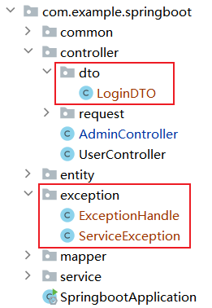

`dto`包：专门存放返回值的实体类；

`exception`包：结合业务层进行异常处理。

### 7.2.1 异常处理

- 新建`LoginDTO`

```java
package com.example.springboot.controller.dto;
import lombok.Data;

//  专门存放返回值dto
@Data
public class LoginDTO {
    private Integer id;
    private String username;
    private String phone;
    private String email;
}
```

- 新建`ExceptionHandle`，实现全局异常处理：

```java
package com.example.springboot.exception;
import com.example.springboot.common.Result;
import lombok.extern.slf4j.Slf4j;
import org.springframework.web.bind.annotation.ExceptionHandler;
import org.springframework.web.bind.annotation.RestControllerAdvice;

//  全局异常处理
@RestControllerAdvice
@Slf4j
public class ExceptionHandle {

    //  对AdminService中的异常进行处理
    @ExceptionHandler(value = ServiceException.class)
    public Result serviceExceptionError(ServiceException e) {
        log.error("业务异常",e);
        return Result.error(e.getMessage());
    }

    @ExceptionHandler(value = Exception.class)
    public Result exceptionError(Exception e) {
        log.error("系统错误",e);
        return Result.error("系统错误");
    }
}
```

- 新建`ServiceException`，处理业务异常的，虽然继承了`RuntimeException`，目的是不让业务和系统异常混淆。

```java
package com.example.springboot.exception;
public class ServiceException extends RuntimeException {

    public ServiceException(String message) {
        super(message);
    }
}
```

> **_BugTip_**：`java.lang.IllegalArgumentException: Source must not be null`常见错误，写代码的时候未考虑异常情况。

### 7.2.2 登录代码

从前往后：

- `Contrller`

```java
//  登录
@PostMapping("/login")
public Result login(@RequestBody LoginRequest loginRequest) {
	return Result.success(adminService.login(loginRequest));
}
```

- `Service`

```java
//  登录
LoginDTO login(LoginRequest loginRequest);
```

```java
//  登录
@Override
public LoginDTO login(LoginRequest loginRequest) {
	//  需要考虑异常！！
	Admin adminLoginUAP = adminMapper.getByUsernameAndPassword(loginRequest);
	if (adminLoginUAP == null) {
		throw new ServiceException("用户名或密码错误");
	}
	LoginDTO loginDTO = new LoginDTO();
	BeanUtils.copyProperties(adminLoginUAP,loginDTO);
	return loginDTO;
}
```

- `mapper`

```java
//  登录
Admin getByUsernameAndPassword(LoginRequest loginRequest);
```

- `xml`

```xml
<!--  登录  -->
<select id="getByUsernameAndPassword" resultType="com.example.springboot.entity.Admin">
	select * from admin where username = #{username} and password = #{password};
</select>
```

# 8、数据安全

### 8.1 登录界面验证

```html
<el-form :model="admin" :rules="rules" ref="loginForm"  >
	//	别忘记rules、ref
   	//	内部还需绑定prop和@click
</el-form>
```

```javascript
export default {
  name: "LOGIN",
  data() {
    return {
      admin: {},
		//	登录校验规则
      rules: {
        username: [
          {required: true, message: '请输入用户名', trigger: 'blur'},
          {min: 3, max: 10, message: '长度在 3 到 10 个字符', trigger: 'blur'}
        ],
        password: [
          {required: true, message: '请输入密码', trigger: 'blur'},
          {min: 3, max: 10, message: '长度在 3 到 10 个字符', trigger: 'blur'}
        ]
      }
    }
   },
      methods: {
        login() {
            //	登录按钮验证
          this.$refs['loginForm'].validate((valid) => {
            if (valid) {
              request.post('/admin/login', this.admin).then(res => {
                if (res.code === '200') {
                  this.$notify.success("登录成功")
                  this.$router.push('/')
                } else {
                  this.$notify.error(res.msg)
                }
              })
            }
          })
        }
      }
    }
```

> **_BugTip_**：`TypeError: Cannot read property 'validate' of undefined at VueComponent.submitForm`；`ref`和 `$refs['']` 的关键字要一致。

### 8.2 退出按钮

在`Layout`中新添布局：

```vue
      <!--   右侧下拉框   -->
      <div style="flex: 1;text-align: right;padding-right: 50px">
        <el-dropdown size="medium">
          <span class="el-dropdown-link" style="cursor: pointer">
            管理员<i class="el-icon-arrow-down el-icon--right"></i>
          </span>
          <el-dropdown-menu slot="dropdown">
            <el-dropdown-item>
              <div style="width: 60px;text-align: center;overflow: hidden" @click="logout" >退出</div>
            </el-dropdown-item>
          </el-dropdown-menu>
        </el-dropdown>
      </div>
```

```JavaScript
  methods :　{
    logout() {
      //  跳转到登录界面
      this.$router.push('/login')
      //  清除浏览器用户数据
    }
```

> **_BugTip_**：vue中给button按钮添加点击事件，事件不生效问题。
>
> - 原因：浮动的div将子元素button包裹，浏览器无法将其识别为有效宽高的元素，和button本身是没有关系的。
> - 解决：元素`div`清除浮动`overflow:hidden`。

### 8.3 浏览器数据缓存

#### 8.3.1 js-cookie插件

同样的，无法在终端中安装，参考：[3.2.1](#axios)

- 安装代码：`npm i js-cookie -S`

- 导入使用：`import Cookies from 'js-cookie'`

  ```java
  Cookies.set('user', obj)  // 默认失效时间为该网站关闭时
  Cookies.set('user', obj, { expires: 1 })  // 1天过期
  Cookies.get('user')  // 获取cookie数据
  Cookies.remove('user')  // 删除cookie数据
  ```

#### 8.3.2 请求拦截器

在`request.js`中设置拦截器，如果得到登录信息，才能进入，不然只能一直在登录页面。

```js
import Cookies from 'js-cookie'
...

//  没有登录信息就不能进主页home
    //  请求拦截器
    const admin =  Cookies.get('admin')
    if (!admin) {
        router.push('/login')
    }
```

`Layout`，设置`{{ admin.username }}`

- ```vue
      <!--   右侧下拉框   -->
      <div style="flex: 1;text-align: right;padding-right: 50px">
        <el-dropdown size="medium">
          <span class="el-dropdown-link" style="cursor: pointer">
            {{ admin.username }}<i class="el-icon-arrow-down el-icon--right"></i>
          </span>
          <el-dropdown-menu slot="dropdown">
            <el-dropdown-item>
              <div style="width: 60px;text-align: center;overflow: hidden" @click="logout" >退出</div>
            </el-dropdown-item>
          </el-dropdown-menu>
        </el-dropdown>
      </div>
  
- ```javascript
  <script>
  //  导入js-cookie
  import Cookies from 'js-cookie'
  
  export default {
    name: "Layout",
      //	获取Cookie数据，获取到了再转为JSON
    data() {
      return {
        admin: Cookies.get('admin') ? JSON.parse(Cookies.get('admin')) : {}
      }
    },
  
    methods :　{
      logout() {
        //  清除浏览器用户数据
        Cookies.remove('admin')
        //  跳转到登录界面
        this.$router.push('/login')
      }
    }
  }
  </script>

> **_BugTip_**：后台输出Cookie为：`[object%20JSON]`
>
> - `JSON.stringify() `方法是将一个JavaScript值（对象或者数组）转换为一个 JSON字符串；注意方法，我都不好意思写这个bug。

`Login.vue`在登录时，如果不传入参数，Cookie是不会存储的。

- ```javascript
  methods: {
  login() {
          ...
          if (res.data !== null) {
            Cookies.set('admin',JSON.stringify(res.data))
          }
          ...
  	}
  }

### 8.4 保护密码MD5

防止直接通过后台看见密码；从而设置默认密码，并使用MD5方式加密。

在业务层`AdminService.java`中实现

1. 定义默认密码，和一段字符串：

   ```java
       private static final String DEFAULT_PASS = "123";
       private static final String DEFAULT_SALT = "DAHUU";
   ```

2. 在新建管理员时应该有默认密码：

   ```java
   //  添加
       @Override
       public void save(Admin admin) {
           //  设置默认密码
           if (StrUtil.isBlank(admin.getPassword())) {
               admin.setPassword(DEFAULT_PASS);
           }
           //  md5加密
           //admin.setPassword(SecureUtil.md5(admin.getPassword() + DEFAULT_SALT));
           admin.setPassword(SecurePass(admin.getPassword()));	
           adminMapper.sava(admin);
       }
   ```

3. 并且也需要修改登录时的业务逻辑：

   ```java
       //  登录
       @Override
       public LoginDTO login(LoginRequest loginRequest) {
           //  登录的时候，也需要加密，
   //loginRequest.setPassword(SecureUtil.md5(loginRequest.getPassword() + DEFAULT_SALT));
           loginRequest.setPassword(SecurePass(loginRequest.getPassword()));
           //  需要考虑异常！！
           Admin adminLoginUAP = adminMapper.getByUsernameAndPassword(loginRequest);
           if (adminLoginUAP == null) {
               throw new ServiceException("用户名或密码错误");
           }
           LoginDTO loginDTO = new LoginDTO();
           BeanUtils.copyProperties(adminLoginUAP,loginDTO);
           return loginDTO;
       }
   ```

4. 将实现相同逻辑的代码进行封装：

   ```java
       //  封装加密
       public String SecurePass(String password) {
           return SecureUtil.md5(password + DEFAULT_SALT);
       }
   ```

### 8.5 实现404页面

访问不存在的页面，跳转至404页面。

在`index.js`中，添加路由：

```js
    //  404页面
  {
    path: '*',
    component: () => import('@/views/404')
  }
```

新建`404.vue`：

```vue
<template>
  <div style="text-align: center">
    <div style="margin-top: 150px; font-size: 100px; ">404</div>
    <div style="font-size: 50px">未找到页面</div>
    <div>
      <el-button type="text" style="margin-top: 20px; font-size: 30px" @click="$router.push('/')">
      → 返回主页 ←
      </el-button>
    </div>
  </div>
</template>

<script>
export default {
  name: "404"
}
</script>
<style scoped>
</style>
```

### 8.6 路由守卫

在`index.js`中设置路由守卫：

```js
//  路由守卫
router.beforeEach((to, from, next) => {
  if (to.path === '/login') next()
  const admin = Cookies.get("admin")
  //  强制退回到登录界面
  if (!admin && to.path !== '/login') return next("/login")
  //  访问/home的时候，里面存在合法的Cookie，才能放行
  next()
})
```

> 需要注意：在`Login.vue`中，登录方法时，应该先存放Cookie数据再跳转，不然路由守卫会报错。

### 8.7 设置JWT凭证  ※

如果篡改前端数据，可以突破路由守卫，因此需要在后台设置凭证。

- 新建`common\WebConfig`，设置指定controller统一的接口前缀（`/api`），并且设置拦截规则。

```java
package com.example.springboot.common;

import org.springframework.beans.factory.annotation.Autowired;
import org.springframework.context.annotation.Configuration;
import org.springframework.web.bind.annotation.RestController;
import org.springframework.web.servlet.config.annotation.InterceptorRegistry;
import org.springframework.web.servlet.config.annotation.PathMatchConfigurer;
import org.springframework.web.servlet.config.annotation.WebMvcConfigurer;

@Configuration
public class WebConfig implements  WebMvcConfigurer {

    @Autowired
    JwtInterceptor jwtInterceptor;

    @Override
    public void configurePathMatch(PathMatchConfigurer configurer) {
        // 指定controller统一的接口前缀（标识）
        configurer.addPathPrefix("/api", clazz -> clazz.isAnnotationPresent(RestController.class));
    }

    // 加自定义拦截器JwtInterceptor，设置拦截规则
    @Override
    public void addInterceptors(InterceptorRegistry registry) {
        registry.addInterceptor(jwtInterceptor).addPathPatterns("/api/**").excludePathPatterns("/api/admin/login");
        //excludePathPatterns   放开登录页面，登录界面不拦截
    }
}
```

- 修改`request.js`的baseURL，添加接口后缀；

```js
const request = axios.create({
    baseURL: 'http://localhost:9090/api',
    timeout: 5000
})
```

```js
import axios from 'axios'
import router from '@/router/index'
import Cookies from 'js-cookie'

const request = axios.create({
    baseURL: 'http://localhost:9090/api',
    timeout: 5000
})

// request 拦截器
// 可以自请求发送前对请求做一些处理
// 比如统一加token，对请求参数统一加密
request.interceptors.request.use(config => {
    config.headers['Content-Type'] = 'application/json;charset=utf-8';

    //  没有登录信息就不能进主页home
    //  请求拦截器
    const adminJson =  Cookies.get('admin')
    if (adminJson) {
        // 设置请求头token
        config.headers['token'] = JSON.parse(adminJson).token;
    }

    return config
}, error => {
    return Promise.reject(error)
});

// response 拦截器
// 可以在接口响应后统一处理结果
request.interceptors.response.use(
    response => {
        let res = response.data;
        // 兼容服务端返回的字符串数据
        if (typeof res === 'string') {
            res = res ? JSON.parse(res) : res
        }
        if (res.code === '401') {
            router.push('/login')
        }
        return res;
    },
    error => {
        console.log('err' + error) // for debug
        return Promise.reject(error)
    }
)

export default request
```

- 导入`JWT `依赖：

```properties
<!--    JWT 凭证    -->
<dependency>
	<groupId>com.auth0</groupId>
	<artifactId>java-jwt</artifactId>
	<version>3.10.3</version>
</dependency>
```

- 新建`utils\TokenUtils`，JWT的工具类：

```java
package com.example.springboot.utils;

import cn.hutool.core.date.DateUtil;
import cn.hutool.core.util.StrUtil;
import com.auth0.jwt.JWT;
import com.auth0.jwt.algorithms.Algorithm;
import com.example.springboot.entity.Admin;
import com.example.springboot.service.IAdminService;
import lombok.extern.slf4j.Slf4j;
import org.springframework.stereotype.Component;
import org.springframework.web.context.request.RequestContextHolder;
import org.springframework.web.context.request.ServletRequestAttributes;

import javax.annotation.PostConstruct;
import javax.annotation.Resource;
import javax.servlet.http.HttpServletRequest;
import java.util.Date;

@Component
@Slf4j
public class TokenUtils {

    private static IAdminService staticAdminService;

    @Resource
    private IAdminService adminService;

    @PostConstruct
    public void setUserService() {
        staticAdminService = adminService;
    }

    /**
     * 生成token
     *
     * @return
     */
    public static String genToken(String adminId, String sign) {
        return JWT.create().withAudience(adminId) // 将 user id 保存到 token 里面,作为载荷
                .withExpiresAt(DateUtil.offsetHour(new Date(), 2)) // 2小时后token过期
                .sign(Algorithm.HMAC256(sign)); // 以 password 作为 token 的密钥
    }

    /**
     * 获取当前登录的用户信息
     *
     * @return user对象
     *  /admin?token=xxxx
     */
    public static Admin getCurrentAdmin() {
        String token = null;
        try {
            HttpServletRequest request = ((ServletRequestAttributes) RequestContextHolder.getRequestAttributes()).getRequest();
            token = request.getHeader("token");
            if (StrUtil.isNotBlank(token)) {
                token = request.getParameter("token");
            }
            if (StrUtil.isBlank(token)) {
                log.error("获取当前登录的token失败， token: {}", token);
                return null;
            }
            String adminId = JWT.decode(token).getAudience().get(0);
            return staticAdminService.getById(Integer.valueOf(adminId));
        } catch (Exception e) {
            log.error("获取当前登录的管理员信息失败, token={}", token,  e);
            return null;
        }
    }
}
```

- 新建`common\JwtInterceptor`，拦截器

```java
package com.example.springboot.common;

import cn.hutool.core.util.StrUtil;
import com.auth0.jwt.JWT;
import com.auth0.jwt.JWTVerifier;
import com.auth0.jwt.algorithms.Algorithm;
import com.auth0.jwt.exceptions.JWTVerificationException;
import com.example.springboot.entity.Admin;
import com.example.springboot.exception.ServiceException;
import com.example.springboot.service.IAdminService;
import lombok.extern.slf4j.Slf4j;
import org.springframework.beans.factory.annotation.Autowired;
import org.springframework.stereotype.Component;
import org.springframework.web.servlet.HandlerInterceptor;

import javax.servlet.http.HttpServletRequest;
import javax.servlet.http.HttpServletResponse;

@Component
@Slf4j
public class JwtInterceptor implements HandlerInterceptor {

    private static final String ERROR_CODE_401 = "401";

    @Autowired
    private IAdminService adminService;

    @Override
    public boolean preHandle(HttpServletRequest request, HttpServletResponse response, Object handler) {
        String token = request.getHeader("token");
        if (StrUtil.isBlank(token)) {
            token = request.getParameter("token");
        }

        // 执行认证
        if (StrUtil.isBlank(token)) {
            throw new ServiceException(ERROR_CODE_401, "无token，请重新登录");
        }
        // 获取 token 中的adminId
        String adminId;
        Admin admin;
        try {
            adminId = JWT.decode(token).getAudience().get(0);
            // 根据token中的userid查询数据库
            admin = adminService.getById(Integer.parseInt(adminId));
        } catch (Exception e) {
            String errMsg = "token验证失败，请重新登录";
            log.error(errMsg + ", token=" + token, e);
            throw new ServiceException(ERROR_CODE_401, errMsg);
        }
        if (admin == null) {
            throw new ServiceException(ERROR_CODE_401, "用户不存在，请重新登录");
        }

        try {
            // 用户密码加签验证 token
            JWTVerifier jwtVerifier = JWT.require(Algorithm.HMAC256(admin.getPassword())).build();
            jwtVerifier.verify(token); // 验证token
        } catch (JWTVerificationException e) {
            throw new ServiceException(ERROR_CODE_401, "token验证失败，请重新登录");
        }
        return true;
    }
}
```

- token：

在`LoginDTO`中返回token：

```java
    private String token;
```

在login业务层，生成token：

```java
        //  生成token
        String token = TokenUtils.genToken(String.valueOf(adminLoginUAP.getId()),adminLoginUAP.getPassword());
        loginDTO.setToken(token);
```

`Result`中构造方法，传入两个参数的构造方法：

```java
    //  传入两个参数code + msg
    public static Result error(String code,String msg) {
        Result result = new Result();
        result.setCode(code);
        result.setMsg(msg);
        return result;
    }
```

- 新建`common\CorsConfig`，设置自定义头配置，相当于解决跨域：

```java
package com.example.springboot.common;

import org.springframework.context.annotation.Bean;
import org.springframework.context.annotation.Configuration;
import org.springframework.web.cors.CorsConfiguration;
import org.springframework.web.cors.UrlBasedCorsConfigurationSource;
import org.springframework.web.filter.CorsFilter;

@Configuration
public class CorsConfig {

    @Bean
    public CorsFilter corsFilter() {
        UrlBasedCorsConfigurationSource source = new UrlBasedCorsConfigurationSource();
        CorsConfiguration corsConfiguration = new CorsConfiguration();
        corsConfiguration.addAllowedOrigin("*"); // 1 设置访问源地址
        corsConfiguration.addAllowedHeader("*"); // 2 设置访问源请求头
        corsConfiguration.addAllowedMethod("*"); // 3 设置访问源请求方法
        source.registerCorsConfiguration("/**", corsConfiguration); 
// 4 对接口配置跨域设置
        return new CorsFilter(source);
    }
}
```

